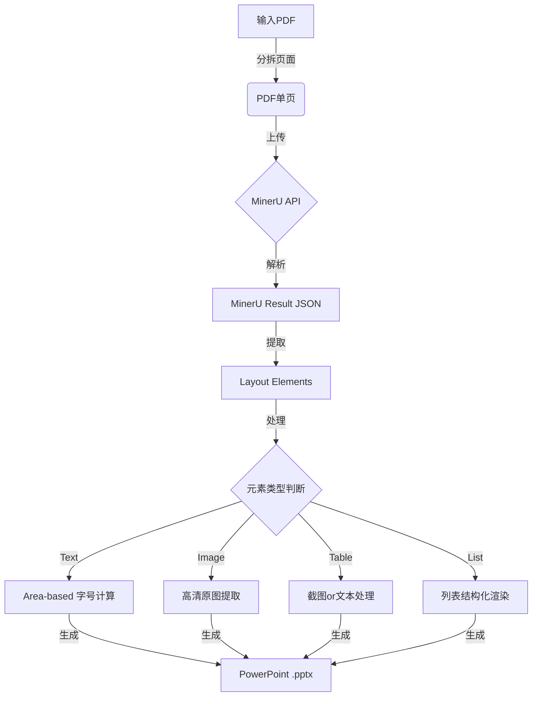
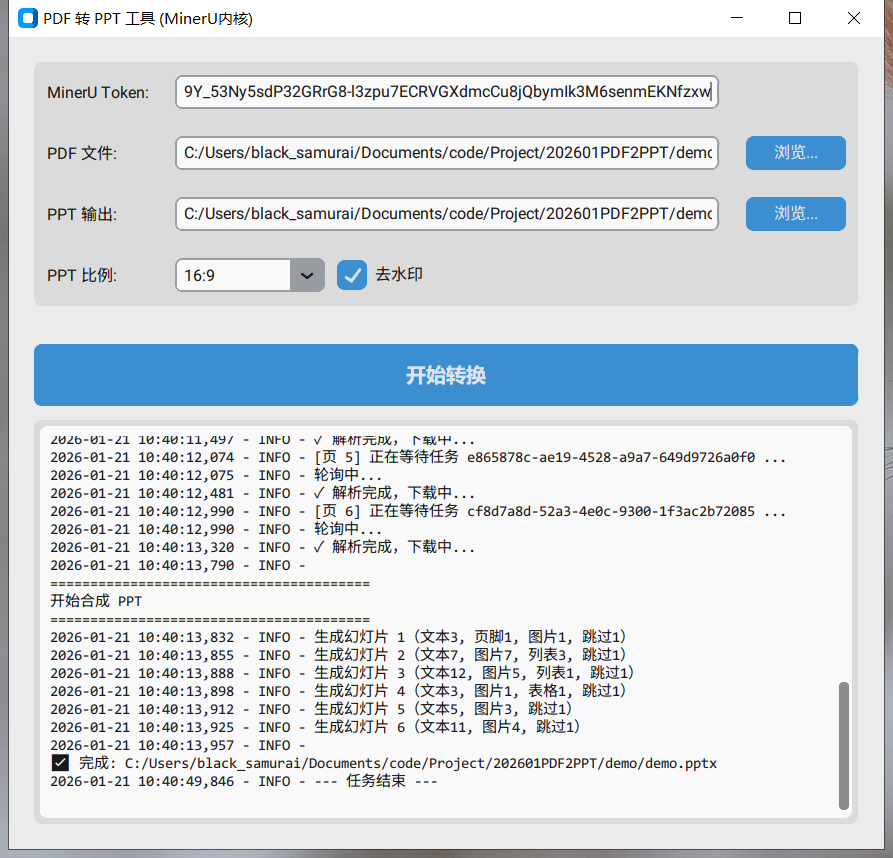

# PDF2PPT

**PDF2PPT** 是一个开源工具，致力于将 AI 生成的 PDF 文稿（如 Google NotebookLM 导出的内容）或其他标准 PDF 文档，通过智能解析转换由于可编辑的 PowerPoint (PPTX) 演示文稿。

本项目利用 **MinerU** 强大的文档解析能力，能够精准识别 PDF 中的文本、图片、表格和列表结构，并将其尽可能完美地还原到 PPT 页面中。

## 核心功能

- **智能解析**: 基于 MinerU 识别 PDF 的深层结构（JSON）。
- **高保真还原**:
  - **图片**: 提取原始高清图片并精确定位。
  - **表格**: 优先以高保真截图方式插入表格，保留复杂排版。
  - **列表**: 自动识别列表结构，优化排版。
  - **字号自适应**: 采用 Area-based 估算算法，自动调整单行标题和多行正文的字号。
- **图形界面 (GUI)**: 提供直观的操作界面，无需命令行即可即开即用。

## 工作流程 (Process Flow)



1. **分拆与解析**: 将 PDF 拆分为单页，发送至 MinerU API 进行深度 OCR 和版面分析。
2. **结构提取**: 解析 MinerU 返回的 JSON 数据，获取带有精确坐标 (`bbox`) 的元素信息。
3. **智能合成**:
   - 根据 bbox 面积和字符密度自动计算最佳字号。
   - 将图片放置在 PPT 对应坐标。
   - 识别表格和列表并进行专门渲染。
4. **输出**: 生成保留原文档逻辑结构的可编辑 PPTX。

## 快速开始

### 1. 申请 MinerU Token

本项目依赖 MinerU API。请前往 [MinerU API 管理台](https://mineru.net/apiManage/token) 注册并获取您的 API Token。

### 2. 配置环境

配置 `config.py` 文件（可参考 `config.example.py`）：

```python
# config.py
MINERU_TOKEN = "您的_MINERU_TOKEN"
PDF_INPUT_PATH = "input.pdf"
PPT_OUTPUT_PATH = "output.pptx"
```

### 3. 运行程序

#### 方式一：GUI 界面 (推荐)

```bash
python app.py
```

#### 方式二：命令行

```bash
python pdf2ppt.py
```

## 版本历史

### v0.2 GUI版本

- **图形化界面**: 新增基于 CustomTkinter 的现代化 GUI 界面 (`app.py`)。
- **操作便捷**: 支持文件拖拽选择、参数可视化配置。
- **打包支持**: 新增 `app.spec` 和 `version_info.txt`，支持通过 pyinstaller 打包为 exe。
- **交互优化**: 实时日志显示，任务进度一目了然。



### v0.1

- **主要特性**:
  - 集成 MinerU API (v4) 上传与解析流程。
  - 实现基于递归 (Recursive) 的 Block 解析，支持复杂嵌套布局。
  - 引入 **Area-based Font Estimation** 算法，解决文字大小不一致问题。
  - 增加对 MinerU `list` 和 `table` 类型的原生支持。
  - 支持配置分离 (`config.py`) 和 解析结果缓存 (`temp/`)。

## 依赖库

- `customtkinter`: 现代 GUI 框架
- `python-pptx`: PPT 生成
- `pymupdf` (fitz): PDF 处理
- `requests`: API 网络请求
