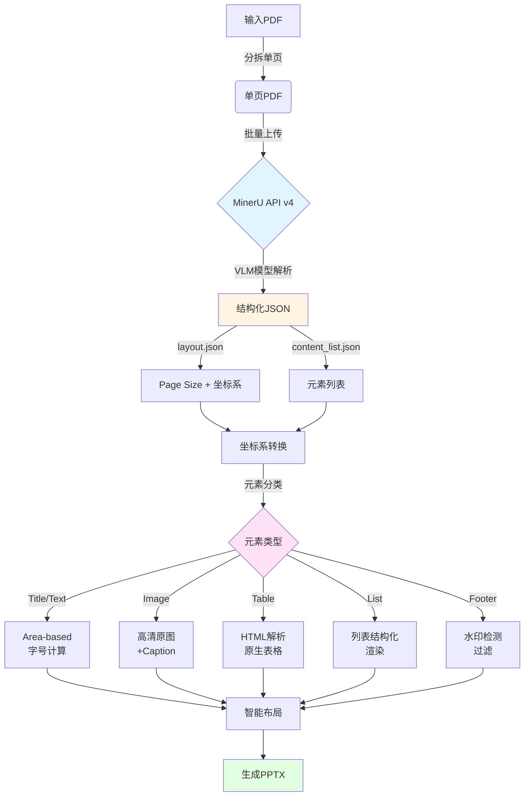
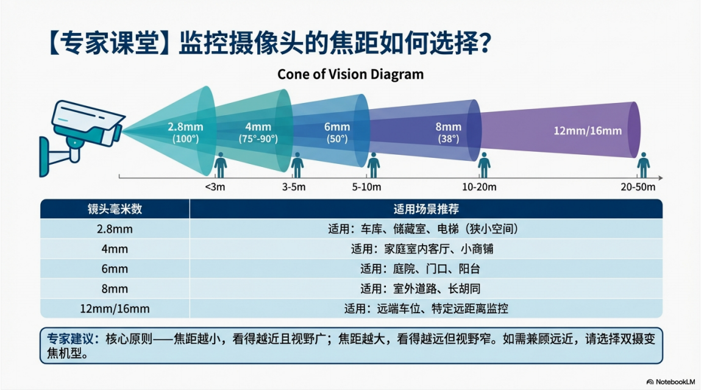
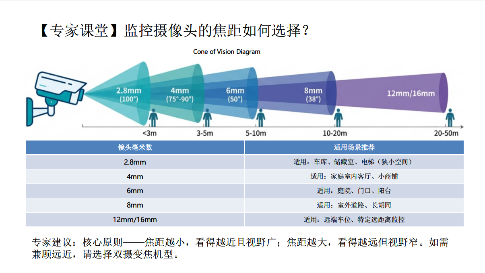

# PDF2PPT

**PDF2PPT** 是一个开源工具，致力于将 AI 生成的 PDF 文稿（如 Google NotebookLM 导出的内容）或其他标准 PDF 文档，通过智能解析转换为可编辑的 PowerPoint (PPTX) 演示文稿。

本项目基于 **MinerU** 强大的文档解析能力，能够精准识别 PDF 中的文本、图片、表格和列表结构，并将其高保真地还原到 PPT 页面中。

## 核心优势

### 🚀 MinerU 技术加持

本项目采用 MinerU API 作为 PDF 文档解析引擎，提供以下核心能力：

- **🎯 精准元素识别**

  - **标题 (Title)**: 识别各级标题，保留层级关系
  - **文本 (Text)**: 提取段落文本，支持多语言 OCR
  - **图片 (Image)**: 提取高清原图，包含图片标题 (image_caption)
  - **表格 (Table)**: 识别复杂表格结构，支持 HTML 格式输出
  - **列表 (List)**: 识别有序/无序列表，保留层级结构
  - **页脚 (Footer)**: 识别页脚和水印文字
- **📍 精确 Bbox 定位**

  - 每个元素都带有精确的边界框坐标 `[x1, y1, x2, y2]`
  - 支持像素级定位，确保 PPT 还原布局一致性
- **🔍 强大 OCR 能力**

  - 支持中英文混排识别
  - LaTeX 公式识别（如 `$360^{\circ}$`）
  - 特殊字符和符号识别

### 💡 智能转换特性

- **Area-based 字号算法**: 根据 bbox 面积和字符密度自动计算最佳字号
- **坐标系智能转换**: 自动处理 PDF 和 PPT 不同坐标系的转换
- **LaTeX 符号清理**: 自动转换 LaTeX 符号为 Unicode 字符（如 `\circ` → `°`）
- **水印智能过滤**: 自动检测和移除重复水印元素
- **表格动态字号**: 表格字号根据单元格高度自适应（10-16pt 范围）

## 工作流程 (Process Flow)



**流程说明**：

1. **PDF 分页**: 将多页 PDF 拆分为单页，支持批量并发处理
2. **MinerU 解析**:
   - 使用 VLM 模型进行深度 OCR 和版面分析
   - 获取两个关键 JSON：`layout.json`（坐标系信息）和 `content_list.json`（元素内容）
3. **坐标转换**: 自动检测并转换 layout 和 content 的不同坐标系
4. **元素处理**:
   - 根据元素类型进行专门处理
   - 图片提取 caption 作为独立文本
   - 表格解析为原生 PPT 表格
5. **智能合成**:
   - Area-based 算法计算最佳字号
   - 精确 bbox 定位保证布局一致性
   - LaTeX 符号清理优化显示效果

## 转换效果对比

以下是实际转换效果对比（使用 Google NotebookLM 生成的 PDF 测试）：

|     **PDF 原始页面**     |     **转换后的 PPT**     |
| :-----------------------------: | :-----------------------------: |
|  |  |


## 下载

您可以直接下载打包好的可执行文件，无需安装Python环境：

- **[PDF2PPT_Tool.exe (v0.3)](https://github.com/blacksamuraiiii/pdf2ppt/releases/download/v0.3/PDF2PPT_Tool.exe)**

## 快速开始

### 1. 安装依赖

```bash
pip install -r requirements.txt
```

### 2. 申请 MinerU Token

本项目依赖 MinerU API。请前往 [MinerU API 管理台](https://mineru.net/apiManage/token) 注册并获取您的 API Token。

### 3. 配置环境

配置 `config.py` 文件（可参考 `config.example.py`）：

```python
# config.py
MINERU_TOKEN = "您的_MINERU_TOKEN"
PDF_INPUT_PATH = "input.pdf"
PPT_OUTPUT_PATH = "output.pptx"
CACHE_DIR = "temp"  # 缓存目录，避免重复调用 API
USE_CACHE = True    # 是否使用缓存
REMOVE_WATERMARK = True  # 是否移除水印
```

### 4. 运行程序

#### 方式一：GUI 界面 (推荐)

```bash
python app.py
```


#### 方式二：命令行

```bash
python pdf2ppt.py
```

## 版本历史

### v0.3 (Latest)

**🎯 智能解析增强**

- ✨ **Layout.json 多源解析**: 同时利用 `layout.json` 和 `content_list.json`，提取 image_caption 的精确 bbox
- 🔄 **坐标系智能转换**: 自动检测并转换不同坐标系，确保元素位置精确
- 🧹 **LaTeX 符号清理**: 增强 LaTeX 公式处理（支持 `\circ`, `\degree`, `\times` 等常用符号）
- 🚫 **水印智能过滤**: 优化水印检测算法，支持关键词匹配、位置判断和重复文本检测

**📊 表格与文本优化**

- 📐 **表格动态字号**: 基于单元格高度自适应字号（10-16pt 范围）
- ⚖️ **表格内容居中**: 垂直和水平双向居中对齐，表头自动加粗
- 📏 **Area-based 字号算法优化**: 缩放因子从 0.8 提升至 0.95，文字更清晰

**🛠️ 代码优化**

- 🧼 **日志精简**: 移除表格尺寸、字号估算等调试信息
- 📦 **缓存机制**: temp 文件夹用于开发调试，生产环境直接使用 API 返回值
- 🎨 **统一样式**: 所有文字统一使用 Area-based 算法和 Microsoft YaHei 字体

### v0.2

**🎨 图形化界面**

- ✨ **GUI 界面**: 基于 CustomTkinter 的现代化界面 (`app.py`)
- 🖱️ **操作便捷**: 文件拖拽选择、参数可视化配置、实时日志显示
- 📦 **打包支持**: 提供 `app.spec` 和 `version_info.txt`，支持 PyInstaller 打包为 exe

**🔧 功能增强**

- 🚫 **去水印功能**: 自动检测和过滤 PDF 中的重复水印元素
- 🌐 **日志汉化**: 统计日志全面汉化，提升可读性
- 🔣 **特殊字符处理**: 针对 `\u200b` 等特殊字符进行转义

### v0.1

**🎉 初始版本**

- 🔗 **MinerU 集成**: 集成 MinerU API (v4) 上传与解析流程
- 🌳 **递归解析**: 实现基于递归的 Block 解析，支持复杂嵌套布局
- 📐 **Area-based 算法**: 引入字号估算算法，解决文字大小不一致问题
- 📊 **元素支持**: 支持 Text、Title、Image、Table、List、Footer 等元素类型
- 💾 **配置与缓存**: 配置分离 (`config.py`) 和解析结果缓存 (`temp/`)

## 依赖库

```
customtkinter==5.2.1
python-pptx==0.6.21
pymupdf==1.23.8
requests==2.31.0
```

详见 `requirements.txt`。

## 致谢

感谢 [MinerU](https://github.com/opendatalab/MinerU) 项目提供强大的文档解析能力！

## License

MIT License
